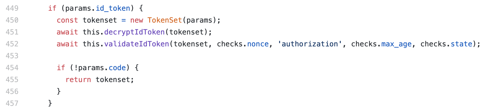

# Xero NodeJS OAuth 2.0 Typescript Starter
Welcome! This app shows a strategy to offer a simple user authentication mechanism utilizing the [OpenID Connect](https://openid.net/connect/) and [OAuth 2.0](https://oauth.net/2/) Specifications. When you give an OA2 authorization flow the `openid profile email` scopes, the provider will send back an `id_token` that you can validate, decode and use to provision a user account for your software.

### Setting up postgresql
1) Install postgres

On mac I reccomend using [homebrew](https://wiki.postgresql.org/wiki/Homebrew) to install. For windows or Ubuntu please follow [postgres' guides](https://www.postgresql.org/download/).
> Helpful guides if you get stuck:
* [MacOS Install](https://www.robinwieruch.de/postgres-sql-macos-setup) to set that up

2) Install sequelize-cli
```bash
npm install --save-dev sequelize-cli
```
3) Create a Postgres user and database
> To setup your initial PG user I reccomend reading https://medium.com/coding-blocks/creating-user-database-and-adding-access-on-postgresql-8bfcd2f4a91e

### Configure with your XeroAPI & Database credentials
1) Login to Xero Developer center https://developer.xero.com/myapps and create a new API application
2) Create a `.env` file in the root of your project
3) Replace the variables in .env
```
CLIENT_ID=...
CLIENT_SECRET=...
REDIRECT_URI=...
DATABASE=...
DATABASE_USER=...
DATABASE_PASSWORD=...
```

### Build and run
> `yarn` and `npm` are interchangeable
```sh
yarn install
yarn start
```

### Code Breakdown
Offering Single Sign On is a valuable way to convert more users to your application. You can read more about the strategy in the two part blog related to this repo.
Part One: [What travel visas teach us about software authentication](https://docs.google.com/document/d/1vGn1ypS1EjRz5v0CeqYVVbcawOW0CMBX4gs-K3Dx2kM/edit)
Part Two: [How to build Single Sign-on (SSO) using OAuth2.0 & OpenID Connect](https://docs.google.com/document/d/1Qrbd-8YG7cvte-FjcR8MweHylztx6BCijy50HjRRpqs/edit)

For the growing ecosystem of companies using both OAuth2.0 and OpenID Connect specifications it becomes simpler to integrate software systems.

The core code you will need to understand for is as follows.
1) OAuth2.0 Scopes
2) OAuth2.0 Callback URL
3) `id_token` validation
4) `id_token` decoding
5) Create or update then 'login' a user

Validate the Id Token. This project uses a dependency that validates for us
